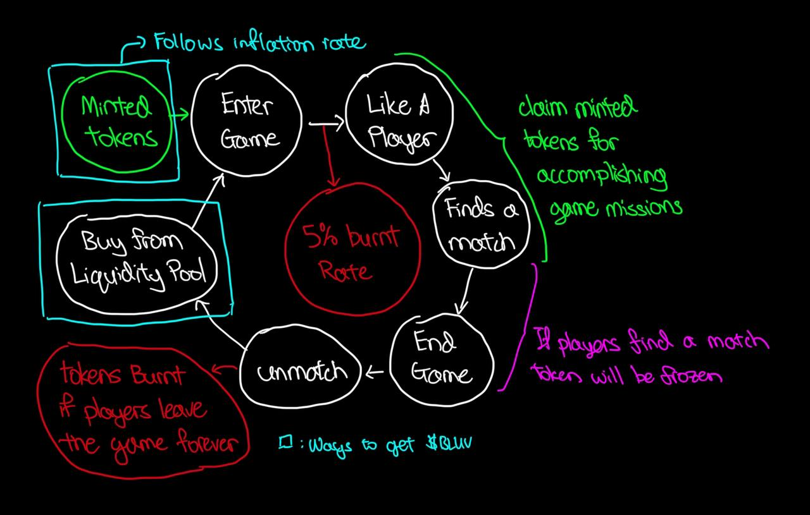

# Cycle of $BLUV

As an inflationary token, $BLUV has a cycle that will be able to control the supply and demand for the token such that playing the game will be affordable and the token will not inflate too much. 

## End Goal of $BLUV

There's only one sole reason why users will come and use ByteLuv, and that is to find someone they like and maybe start a relationship with them. When this is acheived, the user will leave the platform. 

## Cycle of $BLUV

Knowing the end goal of \$BLUV, we can now understand the cycle of \$BLUV. But before we dive into the cycle, let's understand the following conditions:

### Cycle Start

When a player starts the cycle, they will be minted 100 \$BLUV tokens. These tokens will be minted after they are verified and buy \$10 worth of tokens. The player will then be able to use these tokens to play the game.

### Cycle End

When a player leaves the platform, the tokens that they have will be burned/transfered to the platform. This cycle can end with either the end goal being met or the player leaving the platform without finding someone they like.

### Cycle Duration

The cycle will have the duration of **[The ByteLuv Game](../byteLuv-tutorial/byteluv-game.md#the-byteluv-game)** which is 23 hours, with 1 hour of time to register for the next game.

### Cycle Continuation

As soon as the cycle ends, the player will be able to register for the next game. The player will then be able to start the cycle again with 100 \$BLUV tokens.

## Cycle Flow

### Cycle Flow - Entering the Game

Users have 1 hour to consider whether or not they want to start the cycle again. This will include the decision to buy \$BLUV to start the cycle. All first time users can get tokens at \$10 fixed price for 100 tokens, which as seen is relative to the inflation rate at the point in time, once the tokens minted are all bought, the tokens will be available at the market price at the liquidity pool.

### Cycle Flow - Playing the Game

The game has 1 burn and mint mechanism. When a user stakes on another user, there will be a random 5% chance that the tokens will be burned. While tokens may be burned, the user can claim tokens minted by completing objectives and missions in the game. Lastly when it comes to the end of the cycle, matched users will have tokens spent liking frozen.

### Cycle Flow - Exiting the Game

This means that the user either met the positive end goal or the user leaves the platform. Is the user is leaving the platform without finding matches, he/she can liquidate the tokens back to the platform at the market price. If the user met the end goal, the tokens will be burned and the platform will feature the success story of the user, with a hash of the transaction on the blockchain.

### Cycle Flow - Balancing Supply Demand

Being an inflationary token, ByteLuv uses freezing and burning mechanism to control the supply of the token. While the tokens are minted, the tokens that are burned will be taken out of the supply which in the game is a random and luck based mechanism which provides a balance to the supply of the token. Demand will be capped by the amount of tokens that are minted and the number of users that choose to onboard the platform that cycle.

### Cycle Conclusion

With all these balancing and control mechanisms, the cycle of \$BLUV will be able to control the supply and demand of the token such that the game such that each \$BLUV token will have a rough value of \$0.10. 