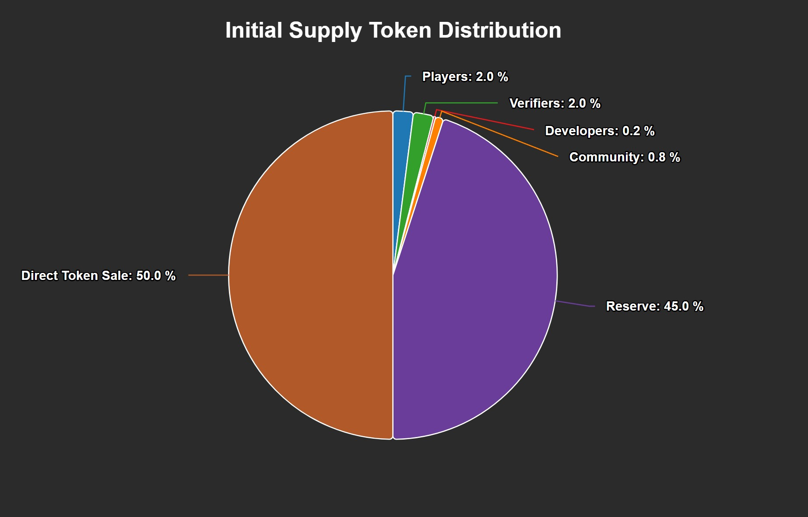
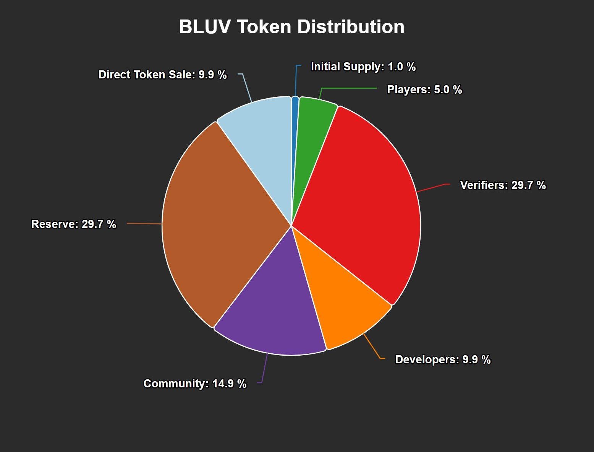
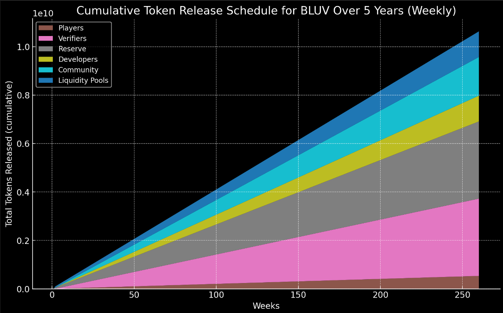

# Tokenomics of $BLUV
The tokenomics of $BLUV is designed such that it incentivizes the growth of the ByteLuv ecosystem. The token is used as a medium of exchange, incentives, and governance.

## About $BLUV
- **Token Name**: Byte of Love (BLUV)
- **Token Type**: SPL Token
- **Token Supply**: 10,000,000,000 BLUV
- **Initial Supply**: 100,000,000 BLUV
- **Future Supply**: 9,900,000,000 BLUV
- **Blockchain**: Solana

## Token Utility

### Medium of Exchange
Used to start the [The ByteLuv Game](../byteLuv-tutorial/byteluv-game.md#the-byteluv-game)

### Incentives
Distribution of rewards to actors in the ByteLuv ecosystem:
1. **Players**: Earned by players of the [The ByteLuv Game](../byteLuv-tutorial/byteluv-game.md#the-byteluv-game)
2. **Verifiers**: Earned by [verifiers](../earn-bluv/profile-verifiers.md#profile-verifiers) for verifying content.

### Governance
Used to vote on proposals in the ByteLuv ecosystem.
1. **Players**: Used to vote on proposals in the [The ByteLuv Game](../byteLuv-tutorial/byteluv-game.md#the-byteluv-game)
2. **Verifiers**: Used to vote on profiles of the players.

## Token Distribution
The token distribution is split into 2 parts:

### Initial Supply

The platform will grow slowly in batches. The initial supply of `100,000,000 BLUV` will be distributed as follows:
1. **Players**: 2,000,000 BLUV
    - Distributed to the first 2000 players of the [The ByteLuv Game](../byteLuv-tutorial/byteluv-game.md#the-byteluv-game)
    - 1000 BLUV per player (Just enough to start the cycle)
2. **Verifiers**: 2,000,000 BLUV
    - Incentives for the first 200 verifiers to 
        a. Verify the first 2000 players
        b. Vote any one that is suspicious
3. **Developers**: 200,000 BLUV
4. **Community**: 800,000 BLUV
5. **Reserve**: 45,000,000 BLUV
    - **Initial Verifier Reserve Allocation**: 20,000,000 BLUV
        - Reserved for the first 200 verifiers to stake and start verifying players.
    - **Initial Player Reserve Allocation**: 20,000,000 BLUV
        - Reserved for the next set of players to join the ByteLuv ecosystem. That will be on the waiting list to be verified.
    - **Initial Developer Reserve Allocation**: 5,000,000 BLUV
        - Reserved for the developers to continue building the platform.
6. **Direct Token Sale **: 50,000,000 BLUV
    - **Initial Coin Offering - Public Sale**: 50,000,000 BLUV

### Future Supply

The remaining `9,900,000,000 BLUV` will be distributed over time as the platform grows, in the following manner [release schedule](#release-schedule):
1. **Players**: 5%
2. **Verifiers**: 30%
3. **Developers**: 10%
4. **Community**: 15%
5. **Reserve**: 30%
6. **Direct Token Sale**: 10%

## Release Schedule

The supply of $BLUV will be released over time as the platform grows. The release schedule is as follows:

1. **Players**:
    This tokens will be distibuted to the first few users in a slow release schedule, release schedule is as follows:
    - **Total Allocation for Players**: 495,000,000 BLUV
    - **Release Mechanism**: 
        In the initial supply, there will be 2,000,000 BLUV distrubuted to 2,000 players to start the first cycle. The remaining 495,000,000 BLUV will be released to the players in the following manner:
        - **Player Waiting List Allocation**: 200,000,000 BLUV
            To be in the waiting list means that one will be able to buy 1,000 BLUV to start the cycle when the next set of players are added to the ecosystem.
            - The launch date of the waiting list will be announced.
            - Everyone in the waiting list will be able to buy 1,000 BLUV at the price of 500 BLUV.
        - **Player Incentives**: 100,000,000 BLUV
            This serves as rewards for users who participate in the first 100 cycles.
            - Each cycle this reward will be distributed equally to people who participate in the cycle and [freeze](../byteLuv-tutorial/terminologies-of-byteluv.md#freeze) more than 800 BLUV.
        - **Community Pool**: 195,000,000 BLUV
            This reserve will be used to build the community on various platforms and used to incentivise the community to participate in the ByteLuv ecosystem.

2. **Verifiers**:
    This set of tokens will be the rewards for verifiers in the ByteLuv ecosystem, release schedule is as follows:
    - **Total Allocation for Verifiers**: 2,970,000,000 BLUV
    - **Release Mechanism**: 
        In the initial supply, there will be 2,000,000 BLUV distrubuted to 200 verifiers to start verifying the first 2,000 players. The remaining 2,970,000,000 BLUV will be released to the verifiers in the following manner:
        - **Verifying incentives**
            - 1,000 BLUV will be used to verify each player.
            - Each verifier will receive BLUV tokens based on the number of players verified.
            - Rewards will be decreased every 2 cycles by 5%, stopping at 200 BLUV per player verified.
        - The tokens will be released on TGE and will be distributed to the verifiers based on the number of players verified.

3. **Reserve**:
    - **Total Allocation for Reserve**: 2,970,000,000 BLUV
    - **Release Mechanism**: 
        In the initial supply, there will be 45,000,000 BLUV reserved for the first set of players, verifiers, developers, and the community. The remaining 2,970,000,000 BLUV will be released to the reserve in the following manner:
        - **Reserve Allocation**
            - **Verifier Reserve Allocation**: 180,000,000 BLUV
                - Reserved for 1800 verifiers to stake and start verifying players.
            - **Player Reserve Allocation**: 2,790,000,000 BLUV
                - Reserved for the players to buy and start the cycle.
                - Weekly release of 10,000,000 BLUV.
            
4. **Developers**:
    - **Total Allocation for Developers**: 990,000,000 BLUV
    - **Release Mechanism**: 
        In the initial supply, there will be 200,000 BLUV reserved for the developers to build the platform. The remaining 990,000,000 BLUV will be released to the developers in the following manner:
        - **Developer Allocation**
            - **Build Allocation**: 200,000,000 BLUV
                - Reserved for the developers to continue building the platform.
                - Quarterly release of 50,000,000 BLUV.
            - **Developer Incentives**: 790,000,000 BLUV
                - Incentives for the developers to participate in the ByteLuv ecosystem.
                - Weekly release of 5,000,000 BLUV.

5. **Community**:
    - **Total Allocation for Community**: 1,485,000,000 BLUV
    - **Release Mechanism**: 
        In the initial supply, there will be 800,000 BLUV reserved for the community. The remaining 1,485,000,000 BLUV will be released to the community in the following manner:
        - **Community Allocation**
            - **Treasury Allocation**: 485,000,000 BLUV
                - Reserved for the community to continue building the platform, released across 5 years.
            - **Community Incentives**: 1,000,000,000 BLUV
                - Incentives for the community to participate in the ByteLuv ecosystem.
                - Released weekly in batches of 1,000,000 BLUV.
                - The release will be done in batches of 1,000,000 BLUV per week until the total allocation is exhausted.

6. **Direct Token Sale Platform**:
    - **Total Allocation for Direct Token Sale Platform**: 990,000,000 BLUV
    - **Release Mechanism**: 
        In the initial supply, there will be 50,000,000 BLUV reserved for the direct token sale. The remaining 990,000,000 BLUV will be released to the liquidity pools in the following manner:
        - **Direct Token Sale Allocation**
            - **Direct Token Sale Allocation**: 50,000,000 BLUV
                - Reserved for the direct token sale.
            - **Public Sale Allocation**: 940,000,000 BLUV
                - Reserved for the public sale.
                - Released weekly in batches of 1,000,000 BLUV.
                - The release will be done in batches of 1,000,000 BLUV per week until the total allocation is exhausted.

## Tokenomics Summary
The above tokenomics is designed to ensure a fair distribution of $BLUV tokens to all actors in the ByteLuv ecosystem. The release schedule ensures that the tokens are distributed over time as the platform grows, incentivizing the growth of the ecosystem. The tokenomics also provide incentives for players, verifiers, developers, and the community to actively participate in the ByteLuv ecosystem.

