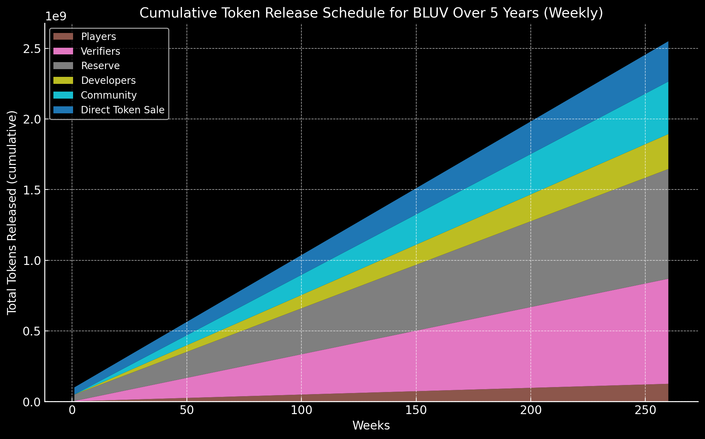

# Tokenomics of $BLUV
The tokenomics of $BLUV is designed such that it incentivizes the growth of the ByteLuv ecosystem. The token is used as a medium of exchange, incentives, and governance.

## About $BLUV
- **Token Name**: Byte of Love (BLUV)
- **Token Type**: SPL Token
- **Initial Token Supply**: 100,000,000 BLUV
- **Token Supply**: Infinite supply
- **Blockchain**: Solana

## Token Utility

### Medium of Exchange
Used to start the [The ByteLuv Game](../byteLuv-tutorial/byteluv-game.md#the-byteluv-game) as well as to verify profiles of players.

### Incentives
Distribution of rewards to actors in the ByteLuv ecosystem:
1. **Players**: Earned by players of the [The ByteLuv Game](../byteLuv-tutorial/byteluv-game.md#the-byteluv-game) for participating in the game.
2. **Verifiers**: Earned by [verifiers](../earn-bluv/profile-verifiers.md#profile-verifiers) for verifying content.

### Governance
Used to vote on proposals in the ByteLuv ecosystem.
1. **Verifiers**: Used to vote on profiles of the players.
2. **Community**: Proposal voting for the development of the platform.

## Token Distribution
The token distribution is split into 2 parts:

### Initial Supply

The platform will grow with the following initial distribution:
1. **Players**: 30,000,000 BLUV - **10,000,000 BLUV sold via direct token sale**
    - Distributed to the first 100,000 players of the [The ByteLuv Game](../byteLuv-tutorial/byteluv-game.md#the-byteluv-game)
    - 300 BLUV per player that is verified, with the following distribution:
        - 100 BLUV to start the cycle
        - 200 BLUV as incetive as they complete some game objectives while playing the game

:::note
This means that one player will be able to earn 200 BLUV per cycle, and 100 BLUV to start the cycle. The player will be able to earn 200 BLUV as incentives as they complete some game objectives while playing the game. Means 300 tokens will be minted per player.
:::

2. **Verifiers**: 20,000,000 BLUV
    - 2,000,000 BLUV Distributed to the first 200 verifiers to be staked and start verifying players
        - 10,000 BLUV per verifier
        - Staked for 6 months
    - 18,000,000 BLUV Distributed to the first 200 verifiers to finilize 300,000 verifications
        - 60 BLUV per decision finalized, split among 3 verifiers
3. **Developers**: 5,000,000 BLUV
    - Distributed to the developers to build the platform in the form of bounties and per task completion
4. **Marketing**: 20,000,000 BLUV
    - Cooporation with KOLs and influencers to promote the platform and host events
5. **Community**: 5,000,000 BLUV
    - In accordiance to the KOLs, to create events and activities that drive participation in the platform
    - 10,000 BLUV per event as rewards to the participants
6. **Exchange Liquidity**: 20,000,000 BLUV
    - To be used for liquidity on exchanges
:::note
The Exchange Liquidity tokens will be there to facilitate the trading of the token on the exchanges. Users with not enough tokens to start the cycle can buy from the exchange and start the cycle.
:::

## Inflation Rate
ByteLuv will be an inflationary token with a logarithmically decreasing inflation rate. The inflation rate will decrease over time as the platform grows stop at a constant rate of 1% per year. The inflation rate will be designed in such a way that it drives exponential growth in the ByteLuv ecosystem. The inflation rate will be calculated as follows:
$$
\text{Inflation Rate} = \text{Initial Rate} \times \frac{1}{\log_{b}\left(\frac{\text{Games Played}}{90} + 2\right)}
$$

- **Initial Rate**: The starting inflation rate.
- **Games Played**: Cumulative number of games played.
- **\( b \)**: Logarithmic base, adjustable to control the rate of decrease.

The inflation rate will be calculated every 90 games played (Per 90 days). The inflation rate will decrease over time as the number of games played increases. The inflation rate will be capped at 2% per year.  The inflation rate will be used to mint new tokens to incentivize the growth of the ByteLuv ecosystem.

## Release Schedule
<!--  -->

The supply of \$BLUV will be released daily based on the inflation rate at that point of time. This amount of tokens that will be minted will act as rewards for the players and as well as new players that are joining the ecosystem. After incentivizing players, the tokens will be allocated to the verifiers and the developers. The remaining tokens will be allocated to the liquidity pools and the community. Below is the release schedule of the \$BLUV tokens:

1. **Players**: 50% of the tokens minted
    - The tokens split into 2 major parts:
        - **Player Incentives**: 50% of the tokens minted
            - Distributed to the players who participate in the game and complete the objectives
            - The rewards will be distributed based on the number of players who participate in the game
        - **New Player Allocation**: 50% of the tokens minted
            - Distributed to the new players who join the ecosystem
            - The rewards will be distributed based on the number of new players who join the ecosystem

2. **Verifiers**: 30% of the tokens minted
    - These tokens will be used to verify the profiles of the new players who join the ecosystem

3. **Developers**: 10% of the tokens minted
    - These tokens will be used to build the platform and to incentivize the developers to participate in the ecosystem
    - The rewards will be distributed based on the number of developers who participate in the ecosystem

4. **Community**: 5% of the tokens minted
    - These tokens will be used to organize events and activities that drive participation in the ecosystem

5. **Exchange Liquidity**: 5% of the tokens minted
    - These tokens will be used to provide liquidity on the exchanges

<!-- 1. **Players**:
    This tokens will be distibuted to the first few users in a slow release schedule, release schedule is as follows:
    - **Total Allocation for Players**: 495,000,000 BLUV
    - **Release Mechanism**: 
        In the initial supply, there will be 2,000,000 BLUV distrubuted to 2,000 players to start the first cycle. The remaining 495,000,000 BLUV will be released to the players in the following manner:
        - **Player Waiting List Allocation**: 200,000,000 BLUV
            To be in the waiting list means that one will be able to buy 1,000 BLUV to start the cycle when the next set of players are added to the ecosystem.
            - The launch date of the waiting list will be announced.
            - Everyone in the waiting list will be able to buy 1,000 BLUV at the price of 500 BLUV.
        - **Player Incentives**: 100,000,000 BLUV
            This serves as rewards for users who participate in the first 100 cycles.
            - Each cycle this reward will be distributed equally to people who participate in the cycle and [freeze](../byteLuv-tutorial/terminologies-of-byteluv.md#freeze) more than 800 BLUV.
        - **Community Pool**: 195,000,000 BLUV
            This reserve will be used to build the community on various platforms and used to incentivise the community to participate in the ByteLuv ecosystem.

2. **Verifiers**:
    This set of tokens will be the rewards for verifiers in the ByteLuv ecosystem, release schedule is as follows:
    - **Total Allocation for Verifiers**: 2,970,000,000 BLUV
    - **Release Mechanism**: 
        In the initial supply, there will be 2,000,000 BLUV distrubuted to 200 verifiers to start verifying the first 2,000 players. The remaining 2,970,000,000 BLUV will be released to the verifiers in the following manner:
        - **Verifying incentives**
            - 1,000 BLUV will be used to verify each player.
            - Each verifier will receive BLUV tokens based on the number of players verified.
            - Rewards will be decreased every 2 cycles by 5%, stopping at 200 BLUV per player verified.
        - The tokens will be released on TGE and will be distributed to the verifiers based on the number of players verified.

3. **Reserve**:
    - **Total Allocation for Reserve**: 2,970,000,000 BLUV
    - **Release Mechanism**: 
        In the initial supply, there will be 45,000,000 BLUV reserved for the first set of players, verifiers, developers, and the community. The remaining 2,970,000,000 BLUV will be released to the reserve in the following manner:
        - **Reserve Allocation**
            - **Verifier Reserve Allocation**: 180,000,000 BLUV
                - Reserved for 1800 verifiers to stake and start verifying players.
            - **Player Reserve Allocation**: 2,790,000,000 BLUV
                - Reserved for the players to buy and start the cycle.
                - Weekly release of 10,000,000 BLUV.
            
4. **Developers**:
    - **Total Allocation for Developers**: 990,000,000 BLUV
    - **Release Mechanism**: 
        In the initial supply, there will be 200,000 BLUV reserved for the developers to build the platform. The remaining 990,000,000 BLUV will be released to the developers in the following manner:
        - **Developer Allocation**
            - **Build Allocation**: 200,000,000 BLUV
                - Reserved for the developers to continue building the platform.
                - Quarterly release of 50,000,000 BLUV.
            - **Developer Incentives**: 790,000,000 BLUV
                - Incentives for the developers to participate in the ByteLuv ecosystem.
                - Weekly release of 5,000,000 BLUV.

5. **Community**:
    - **Total Allocation for Community**: 1,485,000,000 BLUV
    - **Release Mechanism**: 
        In the initial supply, there will be 800,000 BLUV reserved for the community. The remaining 1,485,000,000 BLUV will be released to the community in the following manner:
        - **Community Allocation**
            - **Treasury Allocation**: 485,000,000 BLUV
                - Reserved for the community to continue building the platform, released across 5 years.
            - **Community Incentives**: 1,000,000,000 BLUV
                - Incentives for the community to participate in the ByteLuv ecosystem.
                - Released weekly in batches of 1,000,000 BLUV.
                - The release will be done in batches of 1,000,000 BLUV per week until the total allocation is exhausted.

6. **Direct Token Sale Platform**:
    - **Total Allocation for Direct Token Sale Platform**: 990,000,000 BLUV
    - **Release Mechanism**: 
        In the initial supply, there will be 50,000,000 BLUV reserved for the direct token sale. The remaining 990,000,000 BLUV will be released to the liquidity pools in the following manner:
        - **Direct Token Sale Allocation**
            - **Direct Token Sale Allocation**: 50,000,000 BLUV
                - Reserved for the direct token sale.
            - **Public Sale Allocation**: 940,000,000 BLUV
                - Reserved for the public sale.
                - Released weekly in batches of 1,000,000 BLUV.
                - The release will be done in batches of 1,000,000 BLUV per week until the total allocation is exhausted. -->

## Tokenomics Summary
The above tokenomics is designed to ensure a fair distribution of $BLUV tokens to all actors in the ByteLuv ecosystem. The release schedule ensures that the tokens are distributed over time as the platform grows, incentivizing the growth of the ecosystem. The tokenomics also provide incentives for players, verifiers, developers, and the community to actively participate in the ByteLuv ecosystem.

